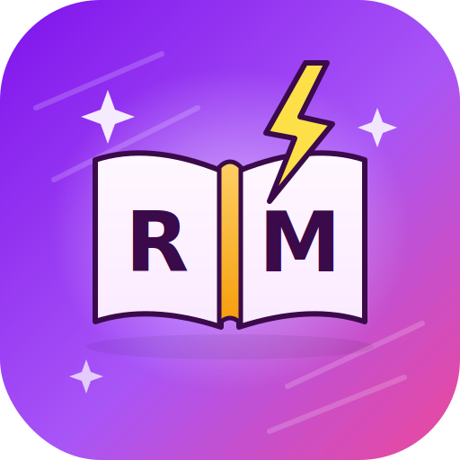

<div align="center">
  
  
  # Revision Master
  
  **Study. Revise. Master.**
  
  A privacy-focused, offline-first study companion designed to help students master their subjects through active recall, spaced repetition, and focused study sessions.
  
  [](https://opensource.org/licenses/MIT)
  [](https://reactjs.org/)
  [](https://tailwindcss.com/)
</div>

---

## 🌟 The Philosophy: Privacy First & Vibe Coding

**Revision Master** is built with a core philosophy: your data belongs to you. 
- 🛡️ **100% Privacy Focused:** Everything you create—your flashcards, formulas, mock test results, and study streaks—is stored **locally on your device**. No databases, no tracking, no cloud syncs reading your notes.
- 🔌 **Offline-First:** You can study anywhere, anytime, without an internet connection. The only feature that requires the internet is the MKR Ai assistant.
- 🎨 **Vibe Coding:** I am not a traditional coder. I do "vibe coding"—I build, customize, and design things my way, focusing on what feels right, looks beautiful, and actually helps students. This app is a product of passion, intuition, and a desire to create the perfect study environment.

## ✨ Key Features

### 📚 Unlimited Flashcards & Decks
Create custom flashcards with images, notes, and various color themes. Organize them into unlimited decks. There are no artificial limits or paywalls.

### 🤖 MKR Ai Assistant & Chatbot
Generate flashcards, formulas, and mock tests automatically using AI. Just provide a topic, select the exact number of items you want, and MKR Ai will create them for you instantly. Need help understanding a concept? Chat with the built-in MKR Ai Chatbot!
*   *Privacy Note:* You can toggle **all AI features off** in the settings if you prefer a completely offline, AI-free experience.
*   *Custom API Key:* You can use the default AI or provide your own Gemini API key in the settings for unlimited usage.

### 📝 Advanced Mock Tests
Test your knowledge with auto-generated mock tests based on your flashcards or AI-generated topics. Features include:
*   **Multiple Modes:** Choose between "Continue with Timer", "Custom Timer", or "No Timer".
*   **Mock Test Feel:** Card revisions now feel like real exams with 4 multiple-choice options.
*   **Detailed Analytics:** Track accuracy, time taken, and review every question with explanations.

### ⚙️ Deep Customization
Revision Master is built to fit your workflow.
*   **Navigation Panel:** Customize the bottom navigation bar's height, icon size, and label visibility in settings.
*   **App Icons:** Choose from multiple professional app icons to match your home screen vibe.
*   **Theming:** 8+ premium themes including OLED Black, Neon, and Emerald.

### 🚀 Interactive Onboarding
A seamless first-time experience that guides you through the app's core features and helps you set up your profile in seconds. Don't want to wait? Use the **Skip** button to jump straight into action with a default profile.

### ⏱️ Customizable Focus Timer
A built-in Pomodoro timer with Study, Short Break, Long Break, and Custom duration modes. Includes a "Deep Focus" mode to block distractions and keep you in the zone.

### ∑ Formula Library
A dedicated section for storing and reviewing math, physics, and chemistry formulas, complete with beautiful formatting.

### 🎨 Modern, Customizable UI & SVG Animations
A beautiful, responsive interface with multiple themes (Light, Dark, OLED, Neon, Sunset, Green, Blue, Purple) to match your vibe. Features professional, smooth SVG animations and transitions throughout the app for a premium feel.

---

## 📱 Building from Source (Android)

Revision Master is ready to be built into a native Android application using [Capacitor](https://capacitorjs.com/).

### Prerequisites for Local Build
*   **Node.js:** v18 or higher
*   **Android Studio:** Installed and configured with SDK Platform 34
*   **JDK:** Java Development Kit 17+
*   **Gradle:** Handled by the project wrapper

### Steps to Build Locally

For a detailed step-by-step guide on building the APK using the terminal (especially on Debian/Linux), see the [BUILD_GUIDE.md](./BUILD_GUIDE.md).

1.  **Clone and Install:**
    ```bash
    git clone https://github.com/mkr-infinity/revision-master.git
    cd revision-master
    npm install
    ```

2.  **Configure Environment Variables:**
    Create a `.env` file in the root directory and add your Gemini API key. This key will be bundled into the app as the default/public key.
    ```env
    GEMINI_API_KEY=your_actual_api_key_here
    ```

3.  **Build Web Assets:**
    ```bash
    npm run build
    ```

4.  **Sync to Android:**
    ```bash
    npx cap sync android
    ```

5.  **Generate Signed APK:**
    *   Open the project in Android Studio: `npx cap open android`
    *   Go to `Build > Generate Signed Bundle / APK...`
    *   Select `APK` and click `Next`.
    *   Choose your Keystore file (or create a new one). **IMPORTANT:** Save this keystore safely; you need it for all future updates.
    *   Select `release` build variant.
    *   Check `V1 (Jar Signature)` and `V2 (Full APK Signature)`.
    *   Click `Finish`. Your APKs will be in `android/app/release/`.

---

## 🚀 GitHub Actions (Auto Build & Release)

This repository is configured to build **3 types of Release APKs** (32-bit, 64-bit, and Universal) automatically on every push to the `main` branch.

### 🔑 Setting Up Your Signing Key (Crucial for Updates)

To ensure your users can install updates over the old version, you **must** sign every build with the same key.

1.  **Prepare your Keystore:**
    *   Locate your `.jks` or `.keystore` file.
    *   Convert it to Base64:
        *   *Windows (PowerShell):* `[Convert]::ToBase64String([IO.File]::ReadAllBytes("your-key.jks"))`
        *   *Mac/Linux:* `base64 -i your-key.jks`
2.  **Add GitHub Secrets:**
    Go to your repository `Settings > Secrets and variables > Actions` and add:
    *   `SIGNING_STORE_FILE`: Paste the **Base64 string** of your keystore.
    *   `SIGNING_STORE_PASSWORD`: Your keystore password.
    *   `SIGNING_KEY_ALIAS`: Your key alias.
    *   `SIGNING_KEY_PASSWORD`: Your key password.

### 📦 Download Your APKs
Once the Action finishes, go to the **Actions** tab, select the run, and download the `release-package`. You will find:
*   `app-armeabi-v7a-release.apk` (32-bit)
*   `app-arm64-v8a-release.apk` (64-bit)
*   `app-universal-release.apk` (Universal - works on all devices)

---

## 🔄 How to Update the App (For Developers)

To ensure old users receive updates correctly, follow these steps:

1.  **Increment Version:**
    Open `android/app/build.gradle` and increase:
    *   `versionCode`: Increment by 1 (e.g., `1` -> `2`).
    *   `versionName`: Update the string (e.g., `"1.0"` -> `"1.1"`).

2.  **Update Version Info:**
    Update `updates/update.json` and `updates/version.json` with the new version details and the download link for the new APK.

3.  **Push to GitHub:**
    Push your changes. GitHub Actions will build the new signed APKs.

4.  **Release:**
    Upload the new APKs to your hosting provider (e.g., GitHub Releases). The app will automatically detect the new `versionCode` and prompt users to update.

> [!CAUTION]
> **NEVER LOSE YOUR KEYSTORE.** If you lose the signing key or change it, existing users will get an "App not installed" error when trying to update. They would have to uninstall the old app (losing their data) to install the new one.

---

## 🚀 Getting Started (Web Development)

### Prerequisites

*   Node.js (v18 or higher)
*   npm or yarn

### Installation

1.  **Clone the repository:**
    ```bash
    git clone https://github.com/mkr-infinity/revision-master.git
    cd revision-master
    ```

2.  **Install dependencies:**
    ```bash
    npm install
    ```

3.  **Set up environment variables:**
    Create a `.env` file in the root directory and add your Gemini API key (optional, for default AI features):
    ```env
    GEMINI_API_KEY=your_api_key_here
    ```

4.  **Start the development server:**
    ```bash
    npm run dev
    ```

5.  Open your browser and navigate to `http://localhost:3000`.

---

## 🛠️ Technologies Used

*   **Frontend:** React, TypeScript, Tailwind CSS, Lucide React (Icons)
*   **Routing:** React Router DOM
*   **State Management:** React Context API (Local Storage Persistence)
*   **AI Integration:** Google GenAI SDK (`@google/genai`)
*   **Build Tool:** Vite
*   **Mobile Build:** Capacitor (Ready)

---

## 👨‍💻 Developer

<div align="center">
  <h3>Mohammad Kaif Raja</h3>
  <p><i>"Excellence is not a gift, but a skill that takes practice."</i></p>
  
  [](https://mkr-infinity.github.io)
  [](https://github.com/mkr-infinity)
  [](https://www.instagram.com/mkr_infinity)
  
  <h4>Support My Work</h4>
  
  [](https://supportmkr.netlify.app/)

  <h4>Other Apps for Students</h4>
  
  [](https://github.com/mkr-infinity/Matrix_Calculator)
</div>

---

## 📄 License

This project is licensed under the MIT License - see the [LICENSE](LICENSE) file for details.

