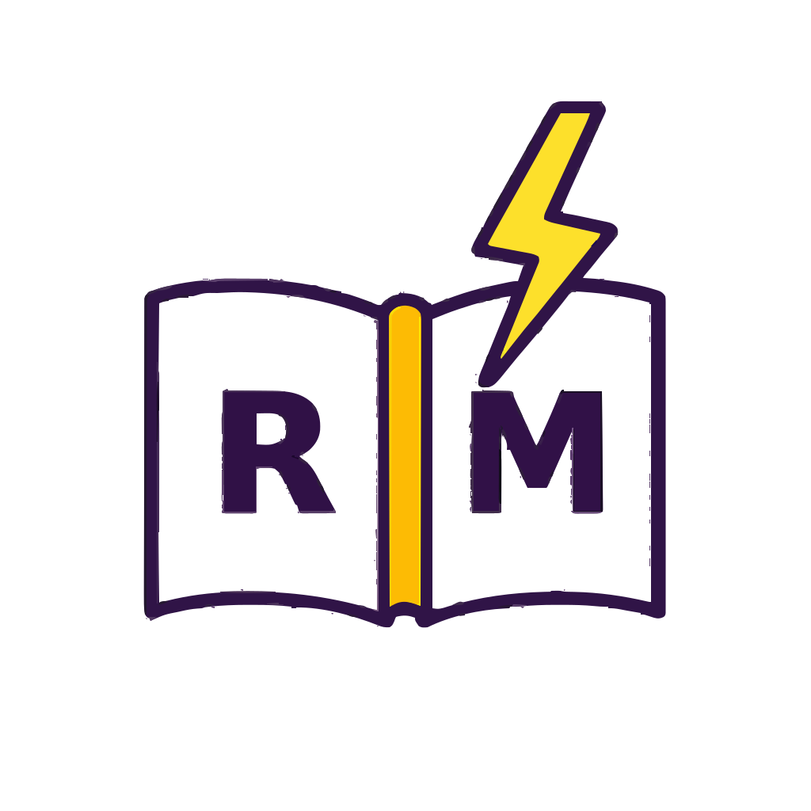

  
  <h1> Revision Master </h1>
  

    <b>The Ultimate Companion for Exam Excellence</b> 
    <i>A high-performance, beautiful, and intuitive study application designed to help students conquer their exams.</i>
  

  

    
    
    
    
  

 

---
## 📲 Download the App

### 📌 Installation Steps
1. Download the APK file  
2. Enable **Install from Unknown Sources**  
3. Open the APK and install  
4. Enjoy the app 🎉

---

## 🌟 Why Revision Master?

In a world full of distractions, **Revision Master** is built to keep you focused. It's not just another study app; it's a precision tool designed for students who value their time and data.

### 🛡️ Privacy Focused (Local-First)
Your study habits and data are yours alone. Revision Master follows a **Local-First Architecture**:
- **Zero Cloud Storage:** All your subjects, flashcards, and progress are stored securely on your device.
- **No Tracking:** No analytics, no cookies, no hidden trackers.
- **Full Control:** Export your entire database as a JSON backup anytime. We don't lock you in.

### ⚡ Built for Speed & Utility
- **Native Experience:** Optimized for mobile with buttery-smooth animations and instant tab switching.
- **Offline Ready:** Study anywhere, anytime. No internet connection required for core features.
- **AI-Powered:** Generate flashcards and study materials instantly using **MKR Ai** (powered by Google Gemini).

---

## ✨ Powerful Features

| Feature | Description |
|-------|-------------|
|  **Smart Subjects** | Organize study material with custom icons and progress tracking |
|  **Active Recall** | Interactive flashcards with support for text, images, formulas |
|  **Exam Simulation** | Create custom mock tests to simulate real exam conditions |
|  **AI Study Buddy** | Generate flashcards and explanations using MKR AI |
|  **Deep Insights** | Track progress with statistics and performance heatmaps |
|  **Offline Study** | Export flashcards and decks as PDFs |

---

## 🎨 Immersive Experience

Revision Master adapts to your style:
- **Dynamic Themes:** Choose from Light, Dark, OLED, Sepia, Hacker Green, and more.
- **Native Feel:** Optimized for mobile with haptic-ready interactions and fluid transitions.
- **Customizable:** Personalize your experience with custom avatars and exam countdowns.

---

## 💖 Support

  

  If you like <b>Revision Master</b>, please consider supporting 🙌

---

  

---

## 📦 Getting Started

### 🌐 Web Development
To run the project locally for development:

> [!TIP]
> For a detailed guide on web deployment and hosting, see our [**Web Build Guide**](./BUILD_GUIDE.md).

---

## 📄 License

This project is licensed under the **MIT License**. See the [LICENSE](LICENSE) file for details.

---

  
Crafted with passion by <b>Mohammad Kaif Raja</b>

  

